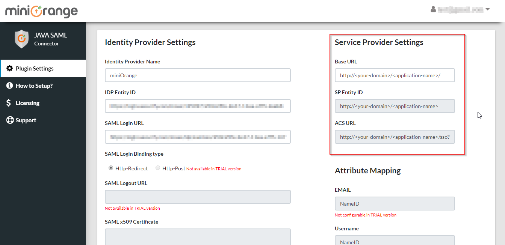
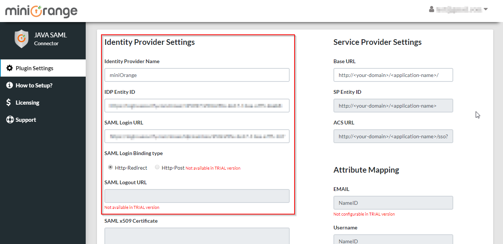
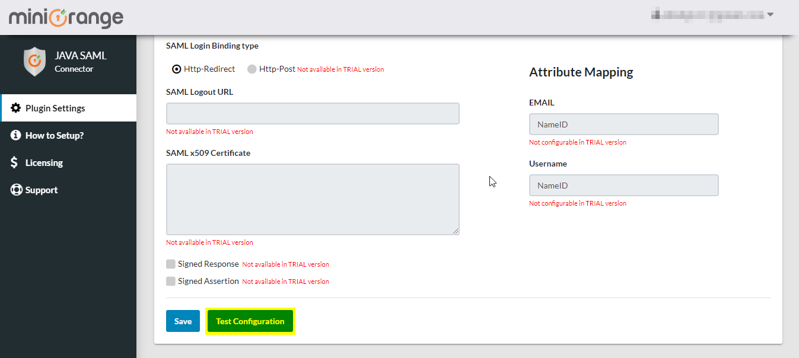
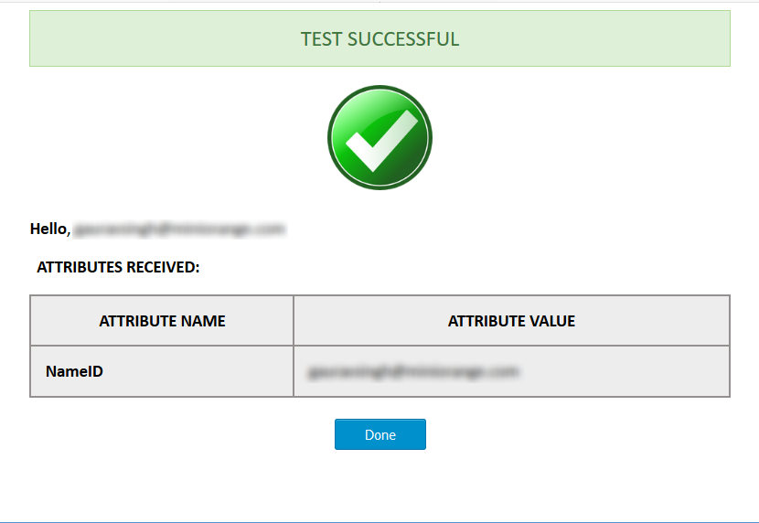

# Deployment guide

## Step 1: Download and Setup the SSO connector in your application.
* Download [miniOrange Java SAML Single Sign On (SSO) Connector jar file](http://plugins.miniorange.com/go/java-saml-single-sign-sso-connector).
* Include the downloaded jar file in the application.
* Copy the jar file and paste it in **WEB-INF/lib** folder of your project.
* Copy the servlet mapping code from [web.xml](https://github.com/miniOrangeDev/java-saml-connector/blob/master/integration/web.xml) and paste it in web.xml file of your project.
* Access SSO connector from your browser with URL **https://&lt;your-domain&gt;/&lt;application-name&gt;/sso**
* Register into SSO connector by providing a valid email address and password.
* After registration, log in to the dashboard using the credentials you provided during registration.

## Step 2: Configure the SSO connector using your Identity Provider details.
* You can configure the **SP Base URL** or leave this option as it is.
* You need to provide these **SP Entity ID** and **ACS URL** values while configuring your Identity Provider.

* Use your Identity Provider details to configure the SSO Connector.

* Click on the **Save** button to save your settings.

## Step 3: Test the Configuration.
* You can test if the SSO Connector is configured properly or not by clicking on the **Test Configuration** button.

* You should see a Test Successful screen as shown below along with the user's attribute values.


## Step 4: Setup the SSO connector to work with your Application.
Once the SSO test is successful, you can provide the Redirect Endpoint, to where the users will be redirected after logging in.
* To do so, click on the **How to Setup?** menu in SSO connector.
* Scroll down to find an option called Redirect Endpoint and provide the URL.
 **NOTE**: The domain of the URL and the domain where you have setup the miniOrange Java Single Sign On (SSO) Connector should be same.
* On this Redirect Endpoint you need to read the user attributes from the session variable that is sent by SSO connector and use that to login user into your application.
* You can use the following code snippet in your redirect endpoint to retrieve the attributes from the session variable.

```java
 HttpSession session = request.getSession(false);
 String email = (String)session.getAttribute("email"); 
```

* The variable **email** will contain the received user attribute. 
* Now that the SSO Connector is configured, you're ready to use it in your application.
  Use the following URL as a link in your application from where you want to perform SSO:
```html
http://<your-domain>/<application-name>/sso?action=login
```  
  OR
  You can use the following URL if you want to redirect user to a specific page after the SSO:
```html
http://<your-domain>/<application-name>/sso?action=login&redirectto=<redirect-url>
```
  For Example, you can use it as:
```html
<a href="http://<your-domain>/<application-name>/sso?action=login&redirectto=/<application-name>/dashboard">Log in</a>
```   
  Your users will be able to SSO in your application by clicking on the **Log in** link.
